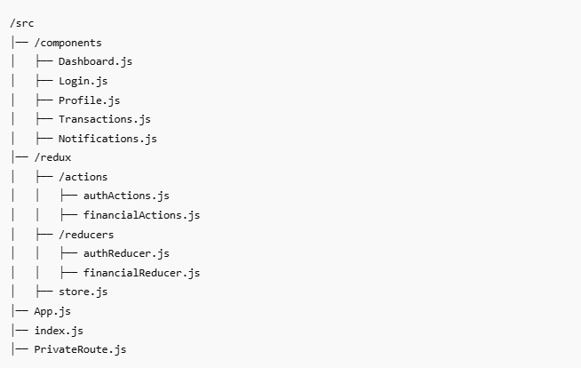

# 🏦 Financial Dashboard with Login and Redux

A simple financial dashboard built using **React**, **Redux**, **Redux Thunk**, and **React Router**. It simulates a user login, displays financial data, and allows users to manage their profile.

---

## 📌 **Features**
- User Login with validation
- Redux-based state management
- Dashboard to display:
  - Account Balance
  - Recent Transactions
  - Notifications
- Profile Management (Update name and password)
- Logout Functionality
- Mock API Simulation using Redux Thunk
---

## 🚀 **Getting Started**

### **Installation**
1. Clone the Repository:
    ```bash
    git clone https://github.com/Govindrajewar/Financial_Dashboard.git
    ```

2. Install Dependencies:
    ```bash
    npm install
    ```

3. Start the Application:
    ```bash
    npm start
    ```

4. Open in Browser:
    ```bash
    http://localhost:3000
    ```

---

## ⚙️ **Project Structure**
---


## 🧑‍💻 **Usage**

### ✅ **Login**
- Use the following credentials to log in:
  - **Username:** `user`
  - **Password:** `password`
- On successful login, the user will be redirected to the **Dashboard**.

### ✅ **Dashboard**
- View your **Account Balance**.
- Track **Recent Transactions**.
- Check any account **Notifications**.

### ✅ **Edit Profile**
- Click the **Edit Profile** button to navigate to the Profile page.
- Update your **Name** and **Password**.
- Click **Save Changes** to apply updates.

### ✅ **Logout**
- Click the **Logout** button to end your session.

---
## 🧾 License
This project is licensed under the MIT License. See the LICENSE file for details.

## ✨ Contact
- **GitHub:** https://github.com/SwapneelKarahale
- **Email:** karahaleswapneel@gmail.com
